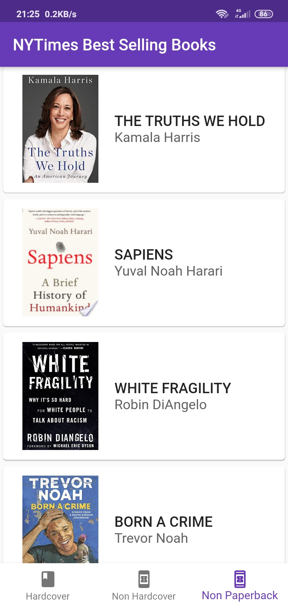
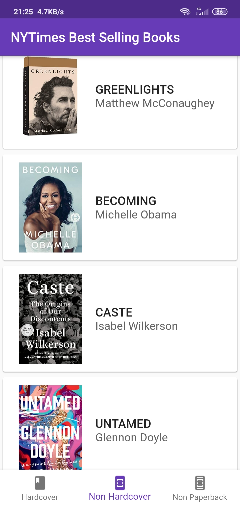
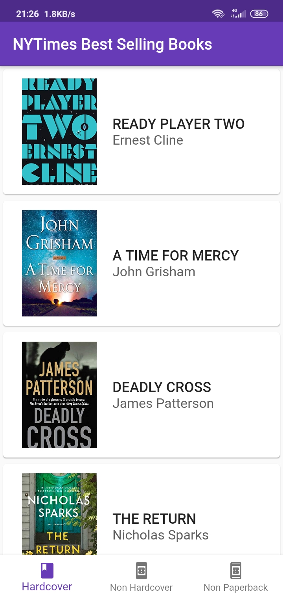
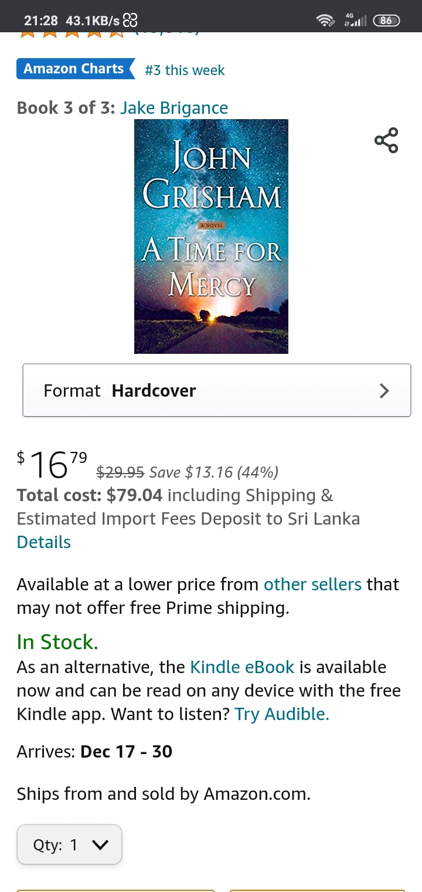

# bookapp

This is an Android mobile application that can fetch and display the best selling books on New York Times.

===Follow these to execute the app===

step01 Download .zip file and unzip it.

step02 Open the folder with Visual Studio Code

step03 Open vs code terminal (Ctrl+Shift+~)

step04 Direct to bookapp directory. use 'cd bookapp' command

step05 Connect your real android device android emulator.

step06 Type 'flutter run' command to execute the app

created by : Deshan Dissanayake 
mail : deshan.biss@gmail.com 
date : 20201214

